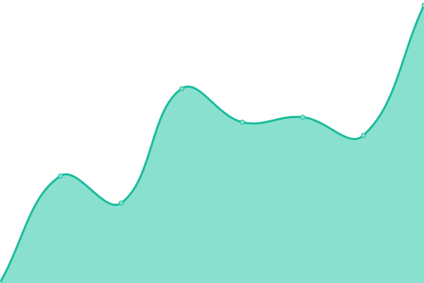
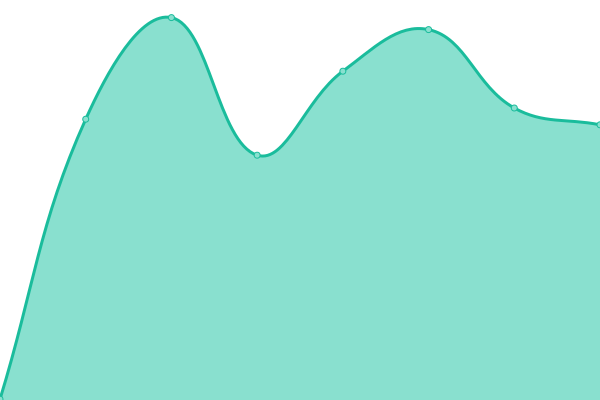
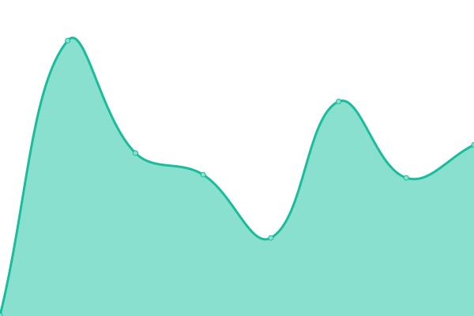
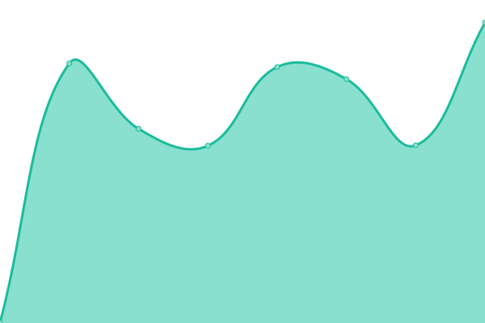
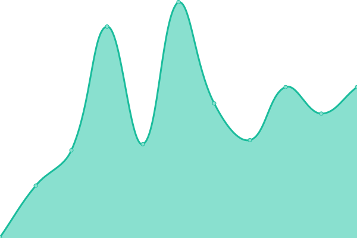

# [📈 Live Status](https://status.ferry.cf): <!--live status--> **🟩 All systems operational**

This repository contains the open-source uptime monitor and status page for [Ferry Bot](https://ferry.cf/), powered by [Upptime](https://github.com/upptime/upptime).

With [Upptime](https://upptime.js.org), you can get your own unlimited and free uptime monitor and status page, powered entirely by a GitHub repository. We use [Issues](https://github.com/ferry-develops/status/issues) as incident reports, [Actions](https://github.com/ferry-develops/status/actions) as uptime monitors, and [Pages](https://status.ferry.cf) for the status page.

<!--start: status pages-->
<!-- This summary is generated by Upptime (https://github.com/upptime/upptime) -->
<!-- Do not edit this manually, your changes will be overwritten -->
<!-- prettier-ignore -->
| URL | Status | History | Response Time | Uptime |
| --- | ------ | ------- | ------------- | ------ |
|  Ferry Bot | 🟩 Up | [ferry-bot.yml](https://github.com/ferry-develops/status/commits/HEAD/history/ferry-bot.yml) | 

 561ms
     
 | 

<a href="https://status.ferry.cf/history/ferry-bot">100.00%</a>
    

|  Site | 🟩 Up | [site.yml](https://github.com/ferry-develops/status/commits/HEAD/history/site.yml) | 

 426ms
     
 | 

<a href="https://status.ferry.cf/history/site">100.00%</a>
    

|  Documentation | 🟩 Up | [documentation.yml](https://github.com/ferry-develops/status/commits/HEAD/history/documentation.yml) | 

 382ms
     
 | 

<a href="https://status.ferry.cf/history/documentation">100.00%</a>
    

|  Phishing Database | 🟩 Up | [phishing-database.yml](https://github.com/ferry-develops/status/commits/HEAD/history/phishing-database.yml) | 

 653ms
     
 | 

<a href="https://status.ferry.cf/history/phishing-database">100.00%</a>
    

|  Mojang API | 🟩 Up | [mojang-api.yml](https://github.com/ferry-develops/status/commits/HEAD/history/mojang-api.yml) | 

 141ms
     
 | 

<a href="https://status.ferry.cf/history/mojang-api">56.65%</a>
    

<!--end: status pages-->

[**Visit our status website →**](https://status.ferry.cf)

## 📄 License

- Powered by: [Upptime](https://github.com/upptime/upptime)
- Code: [MIT](./LICENSE) © [Ferry Bot](https://ferry.cf/)
- Data in the `./history` directory: [Open Database License](https://opendatacommons.org/licenses/odbl/1-0/)
